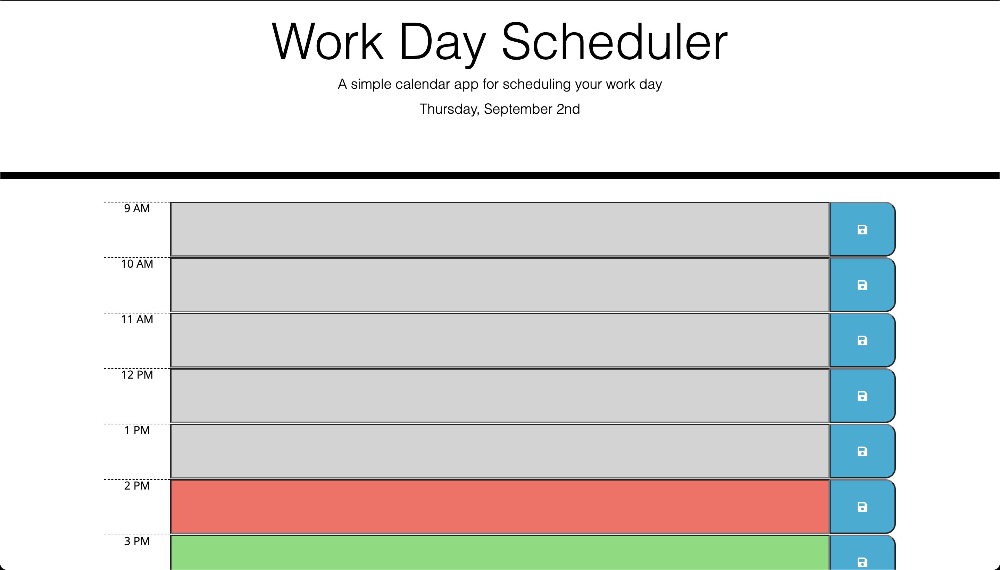
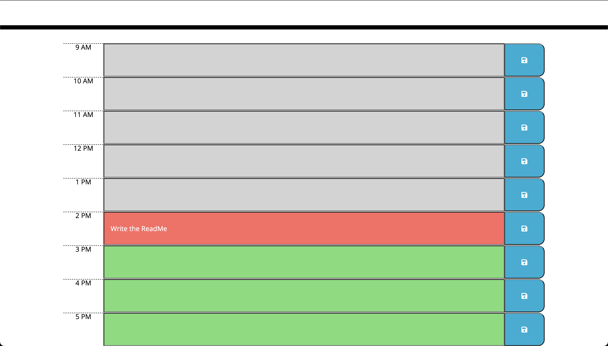

# Work-Day-Scheduler

## Link to Website 
https://bytesizeerror.github.io/Work-Day-Scheduler/

## About the Project
This project helps the user organize their workday by creating these hour blocks that the user can edit. Each block has a save button that can save the text they wrote so when the page is refreshed the text will be saved. The time blocks are also color coded to help the user easily distinguish between past, present, and future.

## Project Demo
### Top of the Page

* This screen shows the top of the page where the current date is presented.
* The date is formatted day of the week, the month, followed by the day.

### Time Blocks

* This screen shows the time blocks from 9 AM - 5 PM.
* The gray blocks are past times.
* The red block is the current time.
* The green blocks are future times.
* The blue save button on the side save the description for that specific time.
* "Write the ReadMe" is the example I provided for 2 PM.

## Usage
The user can use this project to help them manage their daily tasks for each hour of their work schedule. The text written can also be saved for access later on during the day. The color code can help user easily tell what time it is currently.